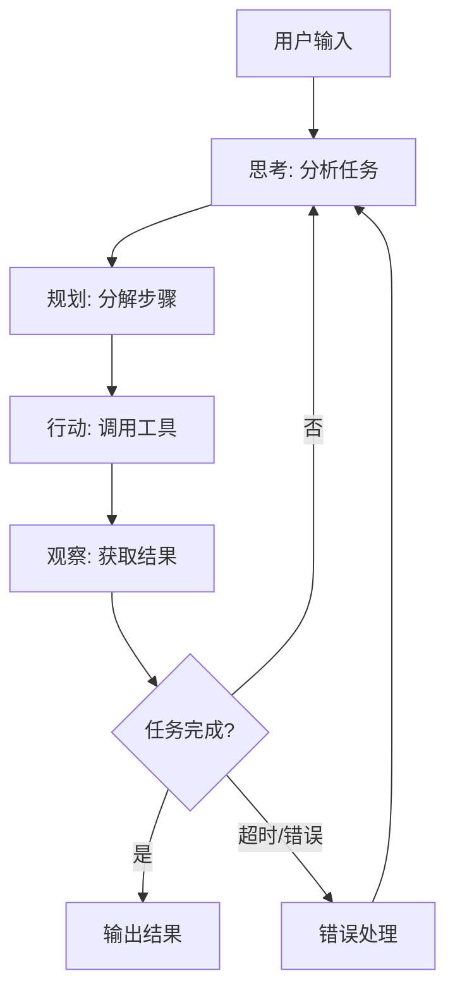
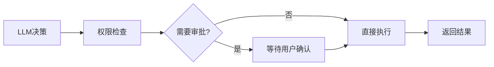

# OpenClaw Agent Loop：智能体循环执行机制

## 一、什么是 Agent Loop？

Agent Loop（智能体循环）是 OpenClaw 的核心执行机制。它采用 **ReAct（Reasoning + Acting）范式**，让 AI 能够处理复杂的非线性任务。

### 核心理念

```
传统聊天机器人：用户输入 → LLM → 输出答案
OpenClaw Agent：用户输入 → 理解意图 → 规划任务 → 执行工具 → 观察结果 → 循环迭代
```

### 设计哲学

OpenClaw 将智能体定位为一个**持续运行的自主任务系统**，而非单纯的聊天工具：

1. **行动导向**：目标是完成任务，而不是回答问题
2. **迭代执行**：通过循环逐步推进复杂任务
3. **自我修正**：根据执行结果调整策略
4. **边界约束**：最大迭代次数防止无限循环

---

## 二、ReAct 范式

### 基本结构

```
┌─────────────────────────────────────────────────────────────┐
│                      ReAct Loop                              │
│                                                              │
│    ┌──────────┐    ┌──────────┐    ┌──────────┐            │
│    │  Thought │ ──▶│   Act    │ ──▶│ Observe  │ ──┐        │
│    │  (思考)  │    │  (行动)  │    │  (观察)  │   │        │
│    └──────────┘    └──────────┘    └──────────┘   │        │
│         ▲                                         │        │
│         └─────────────────────────────────────────┘        │
│                         循环迭代                             │
└─────────────────────────────────────────────────────────────┘
```

### 执行流程



### 示例流程

用户指令：`帮我整理今天的重要邮件，提炼待办并生成一份给老板的简报`

```
循环 1:
  Thought: 需要先读取今天的邮件列表
  Act: 调用 mail_list 工具，参数: date=today
  Observe: 获取到 15 封邮件

循环 2:
  Thought: 需要筛选重要邮件
  Act: 调用 mail_filter 工具，参数: importance=high
  Observe: 筛选出 3 封重要邮件

循环 3:
  Thought: 需要提取待办事项
  Act: 调用 extract_todos 工具
  Observe: 提取出 7 条待办

循环 4:
  Thought: 需要生成简报
  Act: 调用 generate_report 工具
  Observe: 简报已生成

循环 5:
  Thought: 任务完成
  Act: 返回结果
```

---

## 三、核心实现机制

### 上下文守护

Agent 执行前，系统会为模型组装完整的分层上下文：

```javascript
// 上下文组装顺序
const context = [
    // 1. 系统提示词（来自 Bootstrap 文件系统）
    systemPrompt,
    
    // 2. 技能描述注入
    ...skillDescriptions,
    
    // 3. 对话历史
    ...conversationHistory,
    
    // 4. 当前消息
    currentMessage
];
```

### 会话历史管理

采用双层存储：

| 存储层   | 文件            | 用途               |
| -------- | --------------- | ------------------ |
| 轻量索引 | `sessions.json` | 快速查找会话元数据 |
| 重度转录 | `*.jsonl`       | 完整对话内容       |

### 上下文爆炸防护

为防止上下文超出模型限制，系统实施多级防护：

```
1. 历史轮次限制：只保留最近 N 轮对话
2. 工具结果截断：过长的工具输出会被截断
3. 自动压缩：生成摘要替换早期历史
4. 智能召回：只检索相关历史而非全量加载
```

---

## 四、迭代控制

### 最大迭代次数

```javascript
const MAX_ITERATIONS = 20;  // 默认最大 20 轮
```

### 迭代终止条件

| 条件     | 说明               |
| -------- | ------------------ |
| 任务完成 | Agent 返回最终答案 |
| 达到上限 | 超过最大迭代次数   |
| 错误终止 | 无法恢复的严重错误 |
| 用户中断 | 用户主动取消       |

### 超时控制

```javascript
const EXECUTION_TIMEOUT = 300000;  // 5分钟总超时
const TOOL_TIMEOUT = 60000;        // 单工具 1 分钟超时
```

---

## 五、工具调用流程

### 工具发现

1. 扫描工作区 Skills 目录
2. 解析 SKILL.md 文件
3. 提取工具描述和参数 Schema
4. 注入到系统提示词

### 工具选择

LLM 根据当前任务决定调用哪个工具：

```json
{
    "thought": "需要读取邮件列表",
    "action": "mail_list",
    "action_input": {
        "date": "today",
        "folder": "inbox"
    }
}
```

### 工具执行



### 执行安全

| 安全措施 | 说明                 |
| -------- | -------------------- |
| 权限检查 | 检查是否有执行权限   |
| 审批机制 | 高危操作需用户确认   |
| 沙箱隔离 | 在 Docker 容器中执行 |
| 结果过滤 | 敏感信息脱敏         |

---

## 六、错误处理与回退

### 错误类型

| 类型         | 处理方式           |
| ------------ | ------------------ |
| 工具执行失败 | 重试或切换备用方案 |
| 模型调用失败 | 账号轮询或模型降级 |
| 上下文超限   | 压缩历史或截断     |
| 超时         | 终止并报告进度     |

### 重试策略

```javascript
const retryConfig = {
    maxRetries: 3,
    backoff: 'exponential',
    initialDelay: 1000,
    maxDelay: 10000
};
```

### 模型降级

```
主模型失败 → 备用模型 1 → 备用模型 2 → 规则引擎兜底
```

---

## 七、心跳机制

### 设计目的

- 保持 Agent 在线状态
- 定期检查任务进度
- 支持任务中断和恢复

### 实现方式

```javascript
// 心跳间隔
const HEARTBEAT_INTERVAL = 30000;  // 30 秒

// 心跳任务
setInterval(async () => {
    // 1. 检查活跃会话
    // 2. 清理过期资源
    // 3. 同步状态到 Gateway
}, HEARTBEAT_INTERVAL);
```

---

## 八、上下文守护

### 会话车道机制

保证同一 `sessionKey` 下的消息**串行执行**：

```javascript
// 会话锁
const sessionLocks = new Map();

async function processMessage(sessionKey, message) {
    // 获取会话锁
    const lock = sessionLocks.get(sessionKey) || createLock(sessionKey);
    
    // 等待之前的消息处理完成
    await lock.acquire();
    
    try {
        // 处理当前消息
        await executeAgent(message);
    } finally {
        lock.release();
    }
}
```

### 并发控制

```javascript
// 全局并发限制
const MAX_CONCURRENT_SESSIONS = 100;
const semaphore = new Semaphore(MAX_CONCURRENT_SESSIONS);
```

---

## 九、任务持久化与恢复

### 任务状态存储

```javascript
const taskState = {
    taskId: 'xxx',
    status: 'running',  // pending | running | completed | failed
    progress: 0.5,
    checkpoint: {
        iteration: 5,
        lastThought: '...',
        completedSteps: ['step1', 'step2']
    }
};
```

### 恢复机制

1. 系统重启后扫描未完成任务
2. 从 checkpoint 恢复上下文
3. 继续执行剩余步骤

---

## 十、与 WeKnora 对比

| 维度       | OpenClaw        | WeKnora             |
| ---------- | --------------- | ------------------- |
| 范式       | ReAct           | ReAct + EventBus    |
| 最大迭代   | 20 轮           | 20 轮（可配置）     |
| 工具调用   | 同步执行        | 并发调用            |
| 事件驱动   | 无              | EventBus 流式推送   |
| 上下文管理 | 轮次限制 + 压缩 | 滑动窗口 + LLM 摘要 |
| 持久化     | 文件系统        | PostgreSQL + Redis  |

### WeKnora 增强

```go
// WeKnora 的并发工具调用
func (a *Agent) executeTools(ctx context.Context, tools []ToolCall) {
    var wg sync.WaitGroup
    results := make(chan ToolResult, len(tools))
    
    for _, tool := range tools {
        wg.Add(1)
        go func(t ToolCall) {
            defer wg.Done()
            result := a.executeTool(ctx, t)
            a.eventBus.Publish(ToolResultEvent{result})
            results <- result
        }(tool)
    }
    
    go func() {
        wg.Wait()
        close(results)
    }()
}
```
