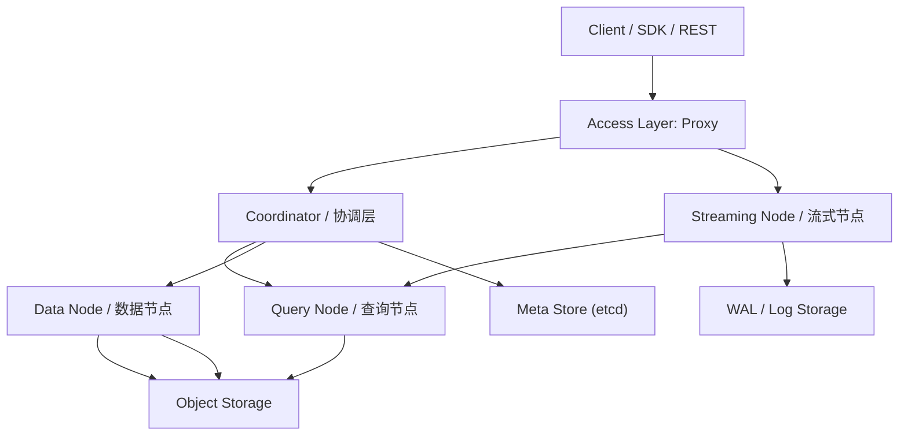
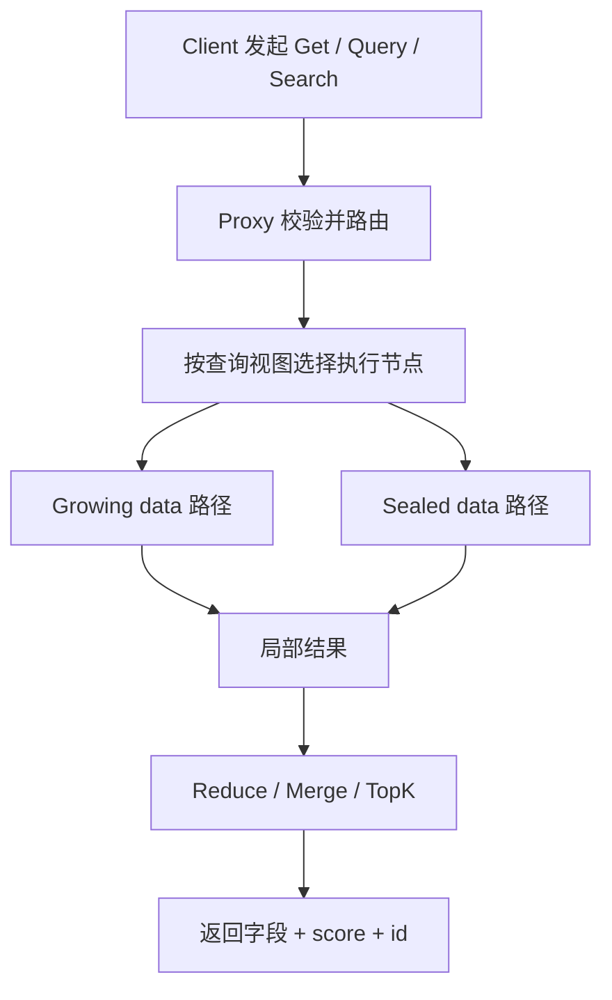
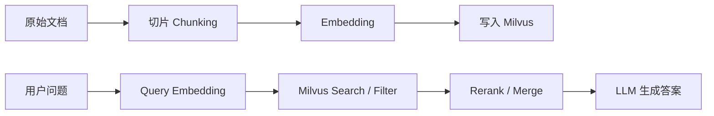

# Milvus 使用与架构详解

> 面向已经懂后端或 AI 应用、但还没有系统掌握向量数据库的人。
>
> 本文默认讨论 **Milvus 2.x**，示例以 **Go SDK v2.6.x 风格**为主。部分组件命名在 Milvus 2.x 不同小版本间有调整，文中会在需要时说明。

---

## 目录

- [1. Milvus 是什么](#1-milvus-是什么)
- [2. Milvus 整体架构](#2-milvus-整体架构)
- [3. 核心数据结构](#3-核心数据结构)
- [4. 写入流程](#4-写入流程)
- [5. 查询流程](#5-查询流程)
- [6. Go SDK 语法与示例](#6-go-sdk-语法与示例)
- [7. 性能与设计要点](#7-性能与设计要点)
- [8. Milvus 在 RAG 中如何使用](#8-milvus-在-rag-中如何使用)
- [9. 常见误区](#9-常见误区)
- [10. 参考资料](#10-参考资料)

---

## 1. Milvus 是什么

Milvus 是一个面向 **海量向量相似度检索** 的分布式数据库。它的核心价值，不是替代 MySQL、PostgreSQL 这类通用事务数据库，而是专门解决下面这类问题：

- “给我找和这段文本语义最接近的 10 段知识片段”
- “给我找和这张图片 embedding 最接近的商品图”
- “在 1 亿条向量里做低延迟 ANN 检索”
- “先按元数据过滤，再做向量召回”

如果把传统数据库理解成“擅长精确匹配”，那么 Milvus 更擅长的是“**高维空间里的近似最近邻检索**”。

### 1.1 它适合什么场景

- RAG / 企业知识库
- 图文、音视频检索
- 推荐系统召回层
- 去重与相似样本发现
- 多模态搜索

### 1.2 它不擅长什么

- 强事务 OLTP
- 复杂多表 Join
- 传统 BI 聚合分析
- 用 SQL 做大量关系建模

### 1.3 它和 Elasticsearch、pgvector、传统数据库的关系

| 方案 | 更擅长 | 什么时候选它 |
| --- | --- | --- |
| MySQL / PostgreSQL | 事务、关系模型、精确条件查询 | 业务主库、订单/用户/权限系统 |
| PostgreSQL + pgvector | 中小规模向量 + 关系数据一体化 | 数据量不夸张、想少一个基础设施 |
| Elasticsearch | 关键词检索、倒排索引、日志搜索 | 以文本检索为主，向量只是补充 |
| Milvus | 大规模向量检索、ANN、多向量检索、分布式扩展 | 向量检索是核心能力，规模和性能要求高 |

一句话概括：

> 如果你的核心问题是“找最像的内容”，Milvus 往往比通用数据库更合适。

---

## 2. Milvus 整体架构

Milvus 2.x 的设计核心是：**存储与计算分离、控制面与数据面分离、流式写入与批式查询协同**。

从使用者角度，你可以把它理解成四层：



### 2.1 访问层：Proxy

Proxy 是无状态入口层，负责：

- 接收 SDK/REST 请求
- 校验参数和 schema
- 路由请求
- 聚合多个执行节点的结果
- 把最终结果返回给客户端

你可以把它理解成 Milvus 的“前门”。

### 2.2 协调层：Coordinator

在较新的 Milvus 2.6.x 官方架构文档里，协调职责被统一描述为 **Coordinator**。它负责：

- 维护集群拓扑
- 处理 DDL / DCL
- 分配时间戳与一致性相关元信息
- 管理查询视图、负载均衡、离线任务
- 调度 compaction、index build 等后台任务

如果你看过一些较早的 2.x 资料，可能会见到这些名字：

- `RootCoord`
- `DataCoord`
- `QueryCoord`
- `IndexNode`

这些可以理解为“旧版本或更细粒度拆分下的协调与执行职责”。在理解上不用纠结版本名差异，关键是知道：

> Milvus 一定有一组组件在负责“集群元数据、调度、视图管理、后台构建任务”。

### 2.3 执行层：Streaming Node / Query Node / Data Node

这是 Milvus 真正“干活”的地方。

#### Streaming Node

主要面向写入链路：

- 承接 DML 写入
- 结合 WAL 保证持久性和故障恢复
- 管理 growing data
- 在一定条件下把 growing segment 转成 sealed segment

#### Query Node

主要面向查询链路：

- 加载历史 segment 和索引
- 对 sealed data 执行 ANN 检索
- 对多个 segment 结果做局部 merge / reduce

#### Data Node

主要负责离线数据处理：

- compaction
- 索引构建
- 持久化历史数据

### 2.4 存储层：Meta、WAL、Object Storage

Milvus 依赖三类存储：

#### Meta Store

通常是 `etcd`，保存：

- collection schema
- segment 元信息
- 消费位点
- 服务注册和健康信息

#### WAL / Log Storage

写入先进入 WAL，再逐步变成可检索数据。

它解决的问题是：

- 写入 durability
- 故障恢复
- 流式消费一致性

#### Object Storage

通常是 MinIO / S3 / Azure Blob 这一类对象存储，用来保存：

- segment 数据文件
- 向量索引文件
- 标量索引文件
- 中间结果

### 2.5 两条最重要的数据流

#### 写入链路

```text
Client
  -> Proxy
  -> Streaming Node
  -> WAL
  -> growing segment
  -> sealed segment
  -> Data Node build index / compaction
  -> Object Storage
  -> Query Node load
```

#### 查询链路

```text
Client
  -> Proxy
  -> 查询路由 / 查询视图
  -> Streaming Node 查询 growing data
  -> Query Node 查询 sealed data
  -> 多级 reduce / merge
  -> Proxy 返回最终 TopK
```

这两条链路背后体现的是 Milvus 的一个核心思想：

> 新写入数据和历史稳定数据，不一定走同一条执行路径，但最后会在查询结果层统一起来。

---

## 3. 核心数据结构

理解 Milvus，最重要的不是先记 API，而是先把它的数据层次想清楚。

### 3.1 逻辑结构

#### Database

数据库命名空间。一个 Milvus 实例里可以有多个 database，用来做环境隔离或业务隔离。

#### Collection

Milvus 最核心的逻辑容器，类似关系数据库里的表。

它定义：

- 字段结构
- 主键
- 向量字段
- 标量字段
- 一致性级别
- 动态字段能力

#### Field Schema

字段定义，常见类型包括：

- `INT64`
- `VARCHAR`
- `BOOL`
- `JSON`
- `ARRAY`
- `FLOAT_VECTOR`
- `BINARY_VECTOR`
- `SPARSE_FLOAT_VECTOR`

#### Primary Key

每条实体的唯一标识。常见是：

- `INT64`
- `VARCHAR`

主键决定了 `Get`、删除、upsert 等行为的基本边界。

#### Vector Field

存放 embedding 的字段，例如：

- 文本向量
- 图片向量
- 多模态向量

最常见的是 `FLOAT_VECTOR`。

#### Scalar Field

用于过滤、展示、分组、路由的字段，例如：

- `doc_id`
- `tenant_id`
- `category`
- `lang`
- `created_at`

### 3.2 物理结构

#### Entity

Milvus 中一行数据通常被叫做一个 entity。你可以把它理解成一条记录。

例如一条知识片段：

```json
{
  "id": 10001,
  "doc_id": "kb_2026_001",
  "chunk_index": 7,
  "content": "Milvus 支持向量检索和标量过滤",
  "embedding": [0.12, -0.04, 0.89, ...]
}
```

#### Segment

segment 是 Milvus 里真正承载数据和索引的物理单元。一个 collection 会被切成多个 segment。

这是一个非常重要的概念，因为：

- 写入是按 segment 演进的
- 索引是按 segment 构建的
- 查询是按 segment 并行执行的

#### Growing Segment

还在持续接收新写入、尚未完全封存的 segment。

特点：

- 新数据先落这里
- 可能还没完成索引构建
- 查询时可能走 brute-force 或专门的 growing 路径

#### Sealed Segment

已经封存、适合构建索引和稳定查询的 segment。

特点：

- 通常已持久化
- 可被 Query Node 高效加载
- 适合 ANN 检索

### 3.3 检索结构

#### Index

Milvus 的索引分两大类：

- 向量索引
- 标量索引

向量索引常见类型：

- `FLAT`
- `IVF_FLAT`
- `IVF_PQ`
- `HNSW`
- `DISKANN`
- `AUTOINDEX`

标量索引常见类型：

- `INVERTED`
- `BITMAP`
- `Trie`

#### Metric Type

向量相似度的度量方式，常见包括：

- `COSINE`
- `L2`
- `IP`

选择 metric 不能拍脑袋，而要和 embedding 模型的训练方式一致。

#### Filter Expression

Milvus 的过滤表达式作用于标量字段，可以用于：

- `Query`
- `Search`
- `Delete`

例如：

```text
tenant_id == 42 AND category in ["faq", "manual"]
```

### 3.4 一张总表看懂层次

| 层次 | 概念 | 你可以怎么理解 |
| --- | --- | --- |
| 逻辑层 | database | 命名空间 |
| 逻辑层 | collection | 表 |
| 逻辑层 | field | 列 |
| 逻辑层 | entity | 行 |
| 物理层 | segment | 数据分片单元 |
| 物理层 | growing segment | 正在接收写入的分片 |
| 物理层 | sealed segment | 已封存、适合索引和查询的分片 |
| 检索层 | vector index | 向量 ANN 加速结构 |
| 检索层 | scalar index | 标量过滤加速结构 |

---

## 4. 写入流程

从应用开发的视角，Milvus 写入不是“insert 完就万事大吉”，而是一个多阶段过程。

### 4.1 第一步：定义 schema

你先定义 collection 的结构：

- 主键字段
- 向量字段
- 标量字段
- 是否允许 dynamic field

### 4.2 第二步：创建 collection

创建 collection 时，可以：

- 只建 schema，不建索引
- 同时带 index params 创建

如果创建时就带上 index params，Milvus 可以在创建后自动加载 collection。

### 4.3 第三步：插入数据

写入 API 常见是：

- `Insert`
- `Upsert`

数据会先进入流式链路，而不是立刻就变成“已经完整索引的静态数据”。

### 4.4 第四步：flush

`flush` 的作用不是“普通保存”，而是推动：

- 数据刷入存储
- segment 封存
- 后续索引构建可推进

经验上：

- 批量写入结束后再 flush
- 不要每插一条就 flush

频繁 flush 会造成 segment 过碎，影响后续 compaction 和查询效率。

### 4.5 第五步：segment 演进

插入后，数据通常经历：

```text
新写入
  -> growing segment
  -> 达到条件后 sealed
  -> 构建索引
  -> Query Node 加载
```

### 4.6 第六步：load

只有 load 到内存里，Milvus 才能高效执行 search / query。

官方文档也明确说明：

> 加载 collection 是执行 search 和 query 的前提。

### 4.7 写入流程小结


---

## 5. 查询流程

Milvus 最容易混淆的地方，是很多人把 `Get`、`Query`、`Search` 说成一回事。实际上它们语义完全不同。

### 5.1 `Get`、`Query`、`Search` 的区别

| 操作 | 核心语义 | 最适合的场景 |
| --- | --- | --- |
| `Get` | 按主键拿数据 | 已知 ID，回表取详情 |
| `Query` | 只做标量过滤 | 按条件查元数据、分页扫描 |
| `Search` | 向量近邻检索，可叠加 filter | embedding 召回 |
| `HybridSearch` | 多个向量请求联合检索并重排 | 多路向量、混合召回 |

### 5.2 `Get`

`Get` 本质上是“按主键精确取回”。

适用于：

- 你已经知道实体 ID
- 你想回表拿原始字段

例如：

- 先 `Search` 拿到 TopK 的主键
- 再 `Get` 拿详情字段

### 5.3 `Query`

`Query` 本质上是“只做标量过滤，不做向量相似度计算”。

例如：

- 查 `tenant_id == 42`
- 查 `category == "manual"`
- 查 `created_at > 1740000000`

它适合：

- 元数据过滤
- 批量定位
- 运维或后台管理场景

### 5.4 `Search`

`Search` 是 Milvus 的核心能力：**ANN 向量检索**。

它通常包含这些要素：

- `collectionName`
- `vectors`
- `annsField`
- `limit`
- `metricType`
- `annParam`
- 可选 `filter`
- 可选 `outputFields`

执行过程可以粗略理解为：

```text
1. 客户端提交查询向量
2. Proxy 接收请求
3. 路由到 growing / sealed 数据视图
4. Query Node 在多个 segment 上并行搜索
5. 对多个 segment 的候选做 reduce / merge
6. Proxy 输出最终 TopK
```

### 5.5 `HybridSearch`

Milvus 里的 `HybridSearch` 不是“BM25 + 向量检索”这个泛义概念，而是更偏向：

> 对多个向量检索请求做联合召回，再用 reranker 合并结果。

典型场景：

- 一条数据有多个向量字段
- 同时用 image embedding 和 text embedding 检索
- 多路 ANN 结果融合

### 5.6 标量过滤是怎么参与 Search 的

Milvus 支持在 `Search` 里直接带 filter 表达式。

这意味着你可以做：

```text
先限定 tenant_id / doc_type / lang
再在限定集合内做向量近邻搜索
```

这比“先全局检索，再在应用层过滤”更合理，因为应用层过滤会破坏 TopK 质量。

### 5.7 Filter 表达式常见语法

Milvus 官方过滤语法支持：

- 比较运算：`== != > >= < <=`
- 范围 / 集合：`IN`, `LIKE`
- 逻辑运算：`AND`, `OR`, `NOT`
- 空值判断：`IS NULL`, `IS NOT NULL`
- JSON / ARRAY 专用操作符

常见例子：

```text
tenant_id == 42
```

```text
lang in ["zh", "en"]
```

```text
category like "manual%"
```

```text
tenant_id == 42 AND publish_ts >= 1740000000
```

```text
metadata["source"] == "wiki" AND metadata["score"] > 0.8
```

```text
ARRAY_CONTAINS(tags, "database")
```

### 5.8 查询链路总结



---

## 6. Go SDK 语法与示例

这一节用一个最小闭环把 Milvus 最常用的 API 串起来。

> 说明：示例按 Milvus 2.6.x Go SDK 风格书写，包路径使用官方推荐的 `github.com/milvus-io/milvus/client/v2`。

### 6.1 安装与连接

```bash
go get -u github.com/milvus-io/milvus/client/v2
```

```go
package main

import (
	"context"
	"log"

	"github.com/milvus-io/milvus/client/v2/milvusclient"
)

func main() {
	ctx := context.Background()

	cli, err := milvusclient.New(ctx, &milvusclient.ClientConfig{
		Address:  "localhost:19530",
		Username: "",
		Password: "",
		DBName:   "default",
	})
	if err != nil {
		log.Fatal(err)
	}
	defer cli.Close(ctx)
}
```

### 6.2 创建 collection 与 schema

下面是一个典型的知识片段集合：

- `id`：主键
- `doc_id`：所属文档
- `chunk_id`：切片 ID
- `lang`：语言
- `embedding`：向量字段

```go
package main

import (
	"context"
	"log"

	"github.com/milvus-io/milvus/client/v2/entity"
	"github.com/milvus-io/milvus/client/v2/index"
	"github.com/milvus-io/milvus/client/v2/milvusclient"
)

func main() {
	ctx := context.Background()

	cli, err := milvusclient.New(ctx, &milvusclient.ClientConfig{
		Address: "localhost:19530",
	})
	if err != nil {
		log.Fatal(err)
	}
	defer cli.Close(ctx)

	collectionName := "kb_chunks"
	dim := 768

	schema := entity.NewSchema().
		WithDynamicFieldEnabled(false).
		WithField(
			entity.NewField().
				WithName("id").
				WithDataType(entity.FieldTypeInt64).
				WithIsPrimaryKey(true).
				WithIsAutoID(false),
		).
		WithField(
			entity.NewField().
				WithName("doc_id").
				WithDataType(entity.FieldTypeVarChar).
				WithMaxLength(128),
		).
		WithField(
			entity.NewField().
				WithName("chunk_id").
				WithDataType(entity.FieldTypeVarChar).
				WithMaxLength(128),
		).
		WithField(
			entity.NewField().
				WithName("lang").
				WithDataType(entity.FieldTypeVarChar).
				WithMaxLength(16),
		).
		WithField(
			entity.NewField().
				WithName("embedding").
				WithDataType(entity.FieldTypeFloatVector).
				WithDim(dim),
		)

	indexOptions := []milvusclient.CreateIndexOption{
		milvusclient.NewCreateIndexOption(
			collectionName,
			"embedding",
			index.NewAutoIndex(entity.COSINE),
		),
	}

	err = cli.CreateCollection(
		ctx,
		milvusclient.NewCreateCollectionOption(collectionName, schema).
			WithIndexOptions(indexOptions...).
			WithConsistencyLevel(entity.ClBounded),
	)
	if err != nil {
		log.Fatal(err)
	}
}
```

### 6.3 创建 partition

partition 不是必须，但如果你确实要按租户、时间分层或冷热点隔离，可以这样建：

```go
err := cli.CreatePartition(
	ctx,
	milvusclient.NewCreatePartitionOption("kb_chunks", "tenant_42"),
)
if err != nil {
	log.Fatal(err)
}
```

### 6.4 插入数据

Milvus Go SDK 支持列式写法和行式写法。列式写法更适合批量导入。

```go
resp, err := cli.Insert(
	ctx,
	milvusclient.NewColumnBasedInsertOption("kb_chunks").
		WithInt64Column("id", []int64{1, 2}).
		WithVarcharColumn("doc_id", []string{"docA", "docA"}).
		WithVarcharColumn("chunk_id", []string{"docA#1", "docA#2"}).
		WithVarcharColumn("lang", []string{"zh", "zh"}).
		WithFloatVectorColumn("embedding", 768, [][]float32{
			make([]float32, 768),
			make([]float32, 768),
		}),
)
if err != nil {
	log.Fatal(err)
}

_ = resp
```

### 6.5 Upsert

当主键已存在时，`Upsert` 会按主键覆盖；不存在时则插入。

```go
_, err = cli.Upsert(
	ctx,
	milvusclient.NewColumnBasedInsertOption("kb_chunks").
		WithInt64Column("id", []int64{2}).
		WithVarcharColumn("doc_id", []string{"docA"}).
		WithVarcharColumn("chunk_id", []string{"docA#2"}).
		WithVarcharColumn("lang", []string{"en"}).
		WithFloatVectorColumn("embedding", 768, [][]float32{
			make([]float32, 768),
		}),
)
if err != nil {
	log.Fatal(err)
}
```

如果你只想更新部分字段，可考虑 partial update 语义，但要先确认你当前 Milvus 版本和 SDK 支持情况。

### 6.6 Flush

批量写入完成后，再统一 flush 更合理。

```go
flushTask, err := cli.Flush(
	ctx,
	milvusclient.NewFlushOption("kb_chunks"),
)
if err != nil {
	log.Fatal(err)
}

if err := flushTask.Await(ctx); err != nil {
	log.Fatal(err)
}
```

### 6.7 LoadCollection

搜索和 query 前，先 load：

```go
loadTask, err := cli.LoadCollection(
	ctx,
	milvusclient.NewLoadCollectionOption("kb_chunks"),
)
if err != nil {
	log.Fatal(err)
}

if err := loadTask.Await(ctx); err != nil {
	log.Fatal(err)
}
```

如果你只想加载部分字段，也可以：

```go
loadTask, err := cli.LoadCollection(
	ctx,
	milvusclient.NewLoadCollectionOption("kb_chunks").
		WithLoadFields("id", "doc_id", "chunk_id", "lang", "embedding"),
)
```

### 6.8 ReleaseCollection

不用的时候释放内存：

```go
err = cli.ReleaseCollection(
	ctx,
	milvusclient.NewReleaseCollectionOption("kb_chunks"),
)
if err != nil {
	log.Fatal(err)
}
```

### 6.9 Get：按主键读取

```go
package main

import (
	"context"
	"fmt"
	"log"

	"github.com/milvus-io/milvus/client/v2/column"
	"github.com/milvus-io/milvus/client/v2/entity"
	"github.com/milvus-io/milvus/client/v2/milvusclient"
)

func main() {
	ctx := context.Background()
	cli, err := milvusclient.New(ctx, &milvusclient.ClientConfig{
		Address: "localhost:19530",
	})
	if err != nil {
		log.Fatal(err)
	}
	defer cli.Close(ctx)

	rs, err := cli.Get(
		ctx,
		milvusclient.NewQueryOption("kb_chunks").
			WithConsistencyLevel(entity.ClStrong).
			WithIDs(column.NewColumnInt64("id", []int64{1, 2})).
			WithOutputFields("doc_id", "chunk_id", "lang"),
	)
	if err != nil {
		log.Fatal(err)
	}

	fmt.Println(rs.GetColumn("id"))
	fmt.Println(rs.GetColumn("doc_id"))
}
```

### 6.10 Query：只做标量过滤

```go
rs, err := cli.Query(
	ctx,
	milvusclient.NewQueryOption("kb_chunks").
		WithFilter(`lang == "zh" AND doc_id == "docA"`).
		WithOutputFields("id", "chunk_id", "lang"),
)
if err != nil {
	log.Fatal(err)
}

fmt.Println(rs.GetColumn("id"))
```

如果你的过滤值来自用户输入，推荐使用模板参数，避免把表达式字符串拼得太重。

### 6.11 Search：向量检索

```go
package main

import (
	"context"
	"fmt"
	"log"

	"github.com/milvus-io/milvus/client/v2/entity"
	"github.com/milvus-io/milvus/client/v2/index"
	"github.com/milvus-io/milvus/client/v2/milvusclient"
)

func main() {
	ctx := context.Background()
	cli, err := milvusclient.New(ctx, &milvusclient.ClientConfig{
		Address: "localhost:19530",
	})
	if err != nil {
		log.Fatal(err)
	}
	defer cli.Close(ctx)

	queryVec := entity.FloatVector(make([]float32, 768))

	results, err := cli.Search(
		ctx,
		milvusclient.NewSearchOption("kb_chunks", 5, []entity.Vector{queryVec}).
			WithANNSField("embedding").
			WithOutputFields("doc_id", "chunk_id", "lang").
			WithConsistencyLevel(entity.ClBounded).
			WithAnnParam(index.NewAutoAnnParam()),
	)
	if err != nil {
		log.Fatal(err)
	}

	fmt.Println(results[0].ResultCount)
}
```

### 6.12 带 filter 的 Search

这是 RAG 场景里最常见的写法：先限制候选范围，再做向量检索。

```go
results, err := cli.Search(
	ctx,
	milvusclient.NewSearchOption("kb_chunks", 10, []entity.Vector{
		entity.FloatVector(make([]float32, 768)),
	}).
		WithANNSField("embedding").
		WithFilter(`lang == "zh" AND doc_id in ["docA", "docB"]`).
		WithOutputFields("id", "doc_id", "chunk_id"),
		WithAnnParam(index.NewAutoAnnParam()),
)
if err != nil {
	log.Fatal(err)
}

_ = results
```

如果你使用的是 IVF 或 HNSW 类型索引，也可以显式传具体搜索参数：

```go
results, err := cli.Search(
	ctx,
	milvusclient.NewSearchOption("kb_chunks", 10, []entity.Vector{
		entity.FloatVector(make([]float32, 768)),
	}).
		WithANNSField("embedding").
		WithFilter(`lang == "zh"`).
		WithAnnParam(index.NewHNSWAnnParam(128)),
)
```

其中常见参数含义是：

- HNSW 的 `ef`：搜索时探索的邻居范围，越大召回通常越好，延迟也越高
- IVF 的 `nprobe`：搜索多少个聚类桶，越大召回通常越高，开销也越高

### 6.13 Delete

按主键删：

```go
res, err := cli.Delete(
	ctx,
	milvusclient.NewDeleteOption("kb_chunks").
		WithInt64IDs("id", []int64{1, 2, 3}),
)
if err != nil {
	log.Fatal(err)
}

fmt.Println(res.DeleteCount)
```

按过滤条件删的思路也一样，本质是把要删除的目标通过表达式圈出来。

### 6.14 HybridSearch

当一个 collection 存在多个向量字段，或者你要用多路向量请求联合召回时，再考虑 `HybridSearch`。

概念上它像这样：

```go
// 伪示意：多路 ANN request，最后统一 rerank
// 官方 Go SDK 中 HybridSearch 使用 NewHybridSearchOption(collection, limit, annRequests...)
// 每个 annRequest 指向一个向量字段或一组向量请求
```

对大多数标准 RAG 项目来说，先把单向量 `Search + Filter + Rerank` 用好，通常已经足够。

### 6.15 语法速查

| 能力 | Go SDK 核心入口 |
| --- | --- |
| 连接 | `milvusclient.New(...)` |
| 建集合 | `CreateCollection` |
| 建分区 | `CreatePartition` |
| 插入 | `Insert` |
| 更新 / 插入 | `Upsert` |
| 刷盘封存 | `Flush` |
| 加载 | `LoadCollection` |
| 释放 | `ReleaseCollection` |
| 按主键取 | `Get` |
| 标量查询 | `Query` |
| 向量搜索 | `Search` |
| 多向量搜索 | `HybridSearch` |
| 删除 | `Delete` |

---

## 7. 性能与设计要点

Milvus 好不好用，很大程度不在“会不会调 API”，而在“schema 和检索策略有没有设计对”。

### 7.1 分区不是越多越好

很多人刚接触 Milvus 时，喜欢按用户、文档、天、小时把 partition 切得非常细。这通常会带来：

- 管理复杂度上升
- 查询扇出增加
- load / release 粒度变碎

更稳妥的原则是：

- partition 用于**明显的大类隔离**
- 细粒度筛选更适合放到 scalar field + filter

### 7.2 向量字段 dimension 不能乱设

dimension 必须和 embedding 模型输出一致。

例如：

- 模型输出 768 维，你就必须建 `dim=768`
- 模型换成 1024 维，不能沿用旧 collection

这也是为什么 RAG 系统里一旦向量字段定了，embedding 模型不能随便切换。

### 7.3 Metric Type 要和模型一致

常见经验：

- 许多文本 embedding 模型更常用 `COSINE`
- 有些模型以 inner product 为目标，则更适合 `IP`
- 欧氏距离场景才考虑 `L2`

不要把 `metric_type` 当成随便改的调参项，它和模型训练目标是耦合的。

### 7.4 索引类型怎么选

一个够用的经验表：

| 索引 | 特点 | 适合场景 |
| --- | --- | --- |
| `FLAT` | 精确检索，最慢，最稳 | 小规模验证、准确性对照 |
| `IVF_FLAT` | 经典倒排聚类，参数直观 | 中大规模通用场景 |
| `HNSW` | 高召回、低延迟，但内存更高 | 内存充足、在线检索 |
| `DISKANN` | 面向更大规模与磁盘友好 | 超大规模数据 |
| `AUTOINDEX` | 由 Milvus 自动选择合适方式 | 希望先快速上线 |

如果你还没有充分 benchmark，工程上很常见的起点是：

- 先用 `AUTOINDEX`
- 或者从 `HNSW + COSINE` 开始

### 7.5 TopK 不是越大越好

`topK` 直接影响：

- 查询延迟
- 网络传输量
- 下游 rerank 成本

RAG 场景常见经验：

- 向量召回 `topK` 先在 `10~50` 之间试
- 最终进 LLM 的上下文再继续裁剪

### 7.6 `nprobe` / `ef` 这些参数怎么理解

它们本质上都是在调“**搜索范围**”：

- 范围大：召回更好，但更慢
- 范围小：更快，但漏召回概率更高

所以正确姿势不是死记参数，而是围绕两个指标调：

- recall
- latency

### 7.7 何时需要 rerank

Milvus 负责的是“向量召回”，但召回结果未必天然就是生成阶段最优上下文。

下面这些情况很值得再加一层 rerank：

- chunk 很短，向量分数容易失真
- 召回候选较多
- 语义相近但答案粒度要求很细
- 你要控制答案引用质量

典型链路是：

```text
embedding -> Milvus TopK -> rerank -> context merge -> LLM
```

---

## 8. Milvus 在 RAG 中如何使用

Milvus 在 RAG 中通常不负责“生成答案”，而负责“把可能有答案的上下文找出来”。

### 8.1 典型 RAG 链路



### 8.2 入库时通常存什么

一个典型 RAG collection 常见字段：

| 字段 | 作用 |
| --- | --- |
| `id` | 主键 |
| `kb_id` | 知识库 ID |
| `doc_id` | 文档 ID |
| `chunk_id` | 片段 ID |
| `chunk_index` | 文档内位置 |
| `content` | 原始文本 |
| `lang` | 语言 |
| `embedding` | 向量 |

### 8.3 查询时通常怎么用

RAG 查询常见模式：

1. 把用户问题转成 query embedding
2. 先按租户 / 知识库 / 文档类型做 filter
3. 用 `Search` 从 Milvus 召回 TopK
4. 对召回结果做 rerank
5. 合并上下文，送给 LLM

伪代码：

```go
queryEmbedding := embed(question)

results, err := cli.Search(
	ctx,
	milvusclient.NewSearchOption("kb_chunks", 20, []entity.Vector{
		entity.FloatVector(queryEmbedding),
	}).
		WithANNSField("embedding").
		WithFilter(`kb_id == "kb_001" AND lang == "zh"`).
		WithOutputFields("doc_id", "chunk_id", "content"),
)
```

### 8.4 为什么 RAG 特别适合 Milvus

因为 RAG 的核心诉求正好是：

- 语义相似检索
- 高 TopK 召回
- 标量过滤
- 可扩展到海量 chunk

这正是 Milvus 的强项。

---

## 9. 常见误区

### 误区 1：Milvus 就是“存 embedding 的表”

不对。Milvus 不是简单存个数组，它本质上是：

- 以 segment 为单位管理数据
- 以 ANN 索引为核心做近邻检索
- 同时支持 scalar filter、load/release、分布式调度

### 误区 2：插入后立刻就是最优搜索状态

不对。新数据通常先在 growing segment，索引和查询视图需要时间演进。

### 误区 3：分区越细，检索越快

不一定。过细 partition 很容易把系统用复杂。

### 误区 4：filter 放应用层也一样

不一样。正确做法往往是：

> 在 Milvus 内部先过滤，再做向量检索。

否则你会得到不稳定的 TopK。

### 误区 5：只要用了向量数据库，就不需要 rerank

不对。向量检索解决的是“召回”，不是“最终排序最优”。

---

## 10. 参考资料

以下是本文主要参考的官方资料，建议结合阅读：

- Milvus 架构总览：
  [https://milvus.io/docs/architecture_overview.md](https://milvus.io/docs/architecture_overview.md)
- Create Collection：
  [https://milvus.io/docs/create-collection.md](https://milvus.io/docs/create-collection.md)
- Load & Release：
  [https://milvus.io/docs/load-and-release.md](https://milvus.io/docs/load-and-release.md)
- Query / Get / QueryIterator：
  [https://milvus.io/docs/get-and-scalar-query.md](https://milvus.io/docs/get-and-scalar-query.md)
- Filtering Explained：
  [https://milvus.io/docs/boolean.md](https://milvus.io/docs/boolean.md)
- Go SDK About：
  [https://milvus.io/api-reference/go/v2.6.x/About.md](https://milvus.io/api-reference/go/v2.6.x/About.md)
- Go SDK Search：
  [https://milvus.io/api-reference/go/v2.6.x/Vector/Search.md](https://milvus.io/api-reference/go/v2.6.x/Vector/Search.md)
- Go SDK Query：
  [https://milvus.io/api-reference/go/v2.6.x/Vector/Query.md](https://milvus.io/api-reference/go/v2.6.x/Vector/Query.md)
- Go SDK Insert：
  [https://milvus.io/api-reference/go/v2.6.x/Vector/Insert.md](https://milvus.io/api-reference/go/v2.6.x/Vector/Insert.md)
- Go SDK Upsert：
  [https://milvus.io/api-reference/go/v2.6.x/Vector/Upsert.md](https://milvus.io/api-reference/go/v2.6.x/Vector/Upsert.md)
- Go SDK Delete：
  [https://milvus.io/api-reference/go/v2.6.x/Vector/Delete.md](https://milvus.io/api-reference/go/v2.6.x/Vector/Delete.md)
- Go SDK Flush：
  [https://milvus.io/api-reference/go/v2.6.x/Vector/Flush.md](https://milvus.io/api-reference/go/v2.6.x/Vector/Flush.md)
- Go SDK LoadCollection：
  [https://milvus.io/api-reference/go/v2.6.x/Management/LoadCollection.md](https://milvus.io/api-reference/go/v2.6.x/Management/LoadCollection.md)
- Go SDK HybridSearch：
  [https://milvus.io/api-reference/go/v2.6.x/Vector/HybridSearch.md](https://milvus.io/api-reference/go/v2.6.x/Vector/HybridSearch.md)

---

## 一句话总结

如果只记一件事，请记这个：

> Milvus 不是“把向量存起来”的地方，而是“围绕向量召回这件事，把写入、索引、过滤、加载、查询、扩展性都体系化做掉”的数据库。
