# 腾讯开源 WeKnora：你的本地私有 NotebookLM

> 比 IMA 更懂你的文档，比 RAGFlow 更好扩展的企业级 AI 知识库平台
>
> GitHub：https://github.com/Tencent/WeKnora | 官网：https://weknora.weixin.qq.com | 协议：MIT License | 版本：v0.3.3

---

## 目录

- [Part 1：部署与使用](#part-1部署与使用)
  - [1.1 WeKnora 是什么？](#11-weknora-是什么)
  - [1.2 五分钟本地部署](#12-五分钟本地部署)
  - [1.3 知识库配置与使用](#13-知识库配置与使用)
  - [1.4 Agent 模式使用](#14-agent-模式使用)
  - [1.5 接入 MCP（Cursor / Claude Desktop）](#15-接入-mcpcursor--claude-desktop)
  - [1.6 开发者快速模式](#16-开发者快速模式)
- [Part 2：架构与核心流程](#part-2架构与核心流程)
  - [2.1 整体系统架构](#21-整体系统架构)
  - [2.2 RAG Pipeline 完整流程](#22-rag-pipeline-完整流程)
  - [2.3 ReAct Agent 执行流程](#23-react-agent-执行流程)
  - [2.4 文档解析异步流程](#24-文档解析异步流程)
  - [2.5 MCP 双向集成架构](#25-mcp-双向集成架构)
  - [2.6 技术栈全景](#26-技术栈全景)
  - [2.7 数据模型设计](#27-数据模型设计)
- [总结](#总结)

---

# Part 1：部署与使用

## 1.1 WeKnora 是什么？

> 你有没有想过，有一天公司内部知识库可以像聊天一样被问答，复杂报告可以被 AI 代劳分析，连外部工具都能被 Agent 自动调用——而这一切，数据永不出内网？腾讯开源的 WeKnora，正在做这件事。

**WeKnora** 是腾讯开源的企业级文档理解与 AI 检索框架。如果你用过 Google 的 NotebookLM 或腾讯自家的 IMA，可以把 WeKnora 理解成**可私有化部署、完全掌控数据、深度可定制**的「本地版 NotebookLM」。

它的核心能力：**上传你的文档，问它任何问题，Agent 会自主检索、推理、调用工具，直到给你一个有据可查的答案。**

| 场景             | 具体用法                                        | 核心价值               |
| ---------------- | ----------------------------------------------- | ---------------------- |
| 🏢 企业知识库问答 | 上传内部手册、规范文档，员工用自然语言查询      | 降低沟通成本，知识沉淀 |
| 📝 合同/法规分析  | 上传合同 PDF，提问关键条款，标注引用来源        | 提升合规效率           |
| 📊 数据分析报告   | 上传 CSV/Excel，Agent 自动写 SQL 分析并生成图表 | 替代初级分析师工作     |
| 🔬 学术研究辅助   | 上传论文集，跨文档检索关联结论                  | 加速文献综述           |
| 🎧 产品技术支持   | 搭建产品手册知识库，对接客服系统                | 降低支持成本           |

---

## 1.2 五分钟本地部署

### 环境要求

| 必须安装                | 推荐配置                      |
| ----------------------- | ----------------------------- |
| Docker + Docker Compose | 16G 内存（含高精度 PDF 解析） |
| Git                     | GPU 可选（本地模型推理）      |
| 机器：4 核 8G 起步      | Ollama（本地模型服务）        |

### 图 1-1：WeKnora 本地部署流程

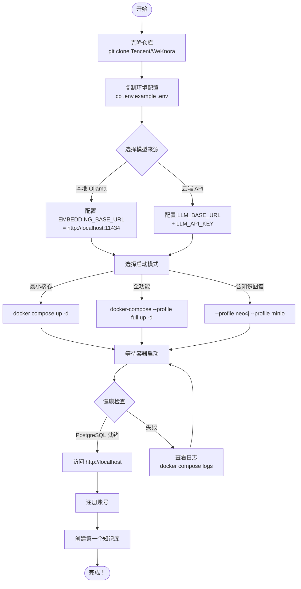

### 关键环境变量说明

```bash
# ── 大模型配置（支持 OpenAI 兼容接口）──────────────────────────
LLM_BASE_URL=https://api.deepseek.com/v1      # 或 Qwen、本地 Ollama
LLM_API_KEY=sk-xxxxxxxxxxxxxxxxxxxx

# ── Embedding 模型（本地 Ollama 最省钱）───────────────────────
EMBEDDING_BASE_URL=http://localhost:11434
EMBEDDING_MODEL=nomic-embed-text              # 或 bge-m3

# ── 数据库（Docker Compose 已内置，通常无需改动）──────────────
POSTGRES_DB=weknora
POSTGRES_USER=weknora
POSTGRES_PASSWORD=your_strong_password

# ── 对象存储（默认本地存储，可选 MinIO/COS/TOS）──────────────
STORAGE_TYPE=local                            # local | minio | cos | tos
```

### 图 1-2：Docker Compose 服务拓扑

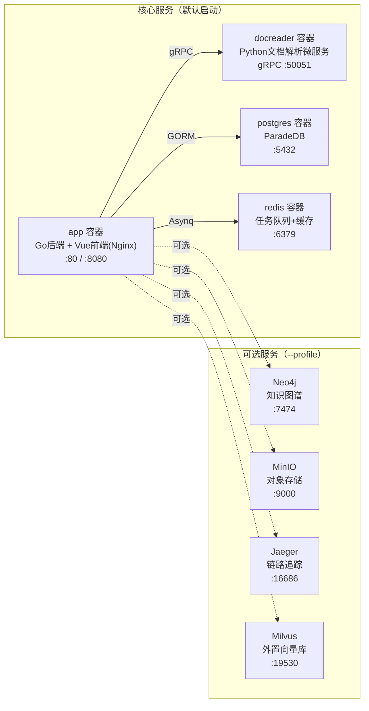

---

## 1.3 知识库配置与使用

### 图 1-3：知识库创建与文档上传流程

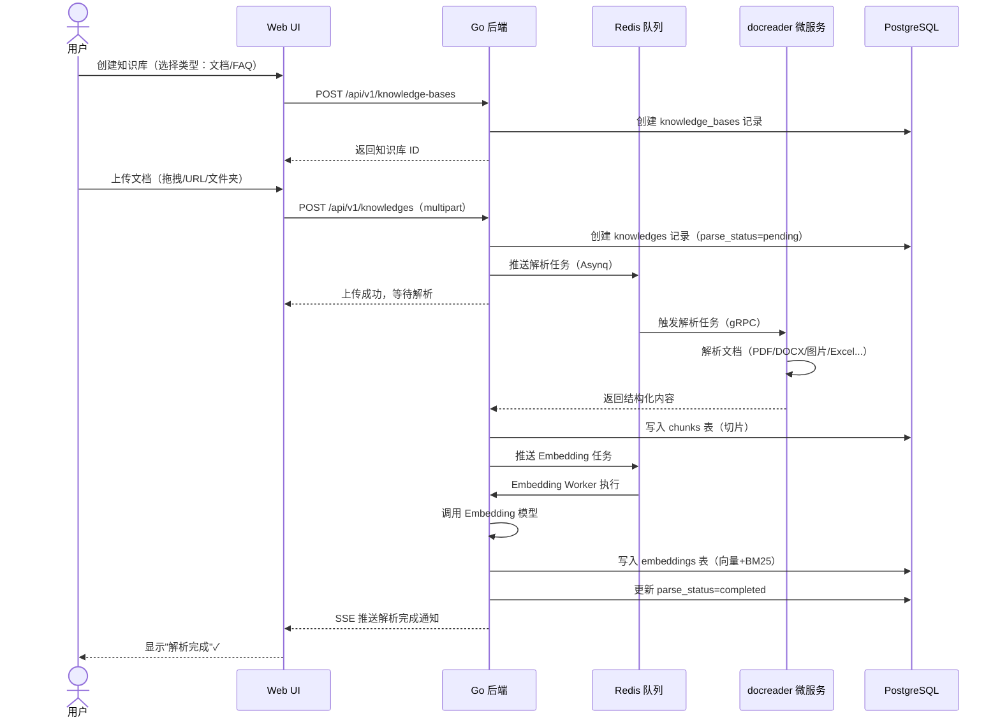

### 支持的文档类型

| 类型     | 格式                | 解析引擎                          | 特殊能力             |
| -------- | ------------------- | --------------------------------- | -------------------- |
| PDF      | .pdf                | pdfplumber + MinerU（高精度模式） | 表格、公式、多栏布局 |
| Word     | .docx / .doc        | python-docx / LibreOffice         | 图片 OCR 提取        |
| 图片     | .png / .jpg / .webp | PaddleOCR / VLM 视觉描述          | 文字识别 + 图片描述  |
| 表格     | .xlsx / .csv        | openpyxl / DuckDB                 | Data Analyst 模式    |
| Markdown | .md                 | mistune                           | 保留标题层级         |
| 网页     | URL                 | ChromeDP + html2markdown          | 动态页面渲染         |

---

## 1.4 Agent 模式使用

WeKnora 提供两种对话模式，在输入框左侧可以切换：

| 模式                              | 说明                             | 适合场景                                     |
| --------------------------------- | -------------------------------- | -------------------------------------------- |
| ⚡ **快速回答（Quick Answer）**    | 单次 RAG 检索，毫秒级响应        | 明确的知识查询、FAQ 问答、简单信息检索       |
| 🧠 **深度推理（Smart Reasoning）** | ReAct 多轮工具调用（最多 20 轮） | 复杂多步骤推理、跨文档综合分析、数据分析报告 |

### Agent 可用的内置工具

| 工具名                  | 功能                   | 典型使用场景             |
| ----------------------- | ---------------------- | ------------------------ |
| `knowledge_search`      | 语义向量检索知识库     | 根据问题语义找相关内容   |
| `grep_chunks`           | 关键词精确匹配切片     | 精确查找特定术语、编号   |
| `list_knowledge_chunks` | 按 ID 读取完整切片内容 | 深度读取已定位的文档段落 |
| `get_document_content`  | 获取文档全文           | 需要完整阅读某份文档     |
| `query_knowledge_graph` | Neo4j 图谱关系查询     | 查询实体关联关系         |
| `web_search`            | 网络搜索（需启用）     | 知识库不足时补充外网信息 |
| `web_fetch`             | 抓取指定网页内容       | 获取特定 URL 页面        |
| `todo_write`            | 创建/更新任务计划      | 多步任务分解与跟踪       |
| `thinking`              | 链式思考记录           | 复杂推理中间过程可视化   |
| `execute_skill`         | 执行 Skills 技能       | 调用外部沙箱脚本         |

> 💡 在「Agent 管理」页面，你可以创建自定义 Agent，配置：模型选择、绑定知识库、允许使用的工具、最大迭代次数（默认 20）、是否开启反思机制、系统 Prompt 模板、RAG 检索阈值等。每个业务场景都可以有一套专属的 Agent 配置。

---

## 1.5 接入 MCP（Cursor / Claude Desktop）

### 图 1-4：WeKnora MCP 双向接入示意

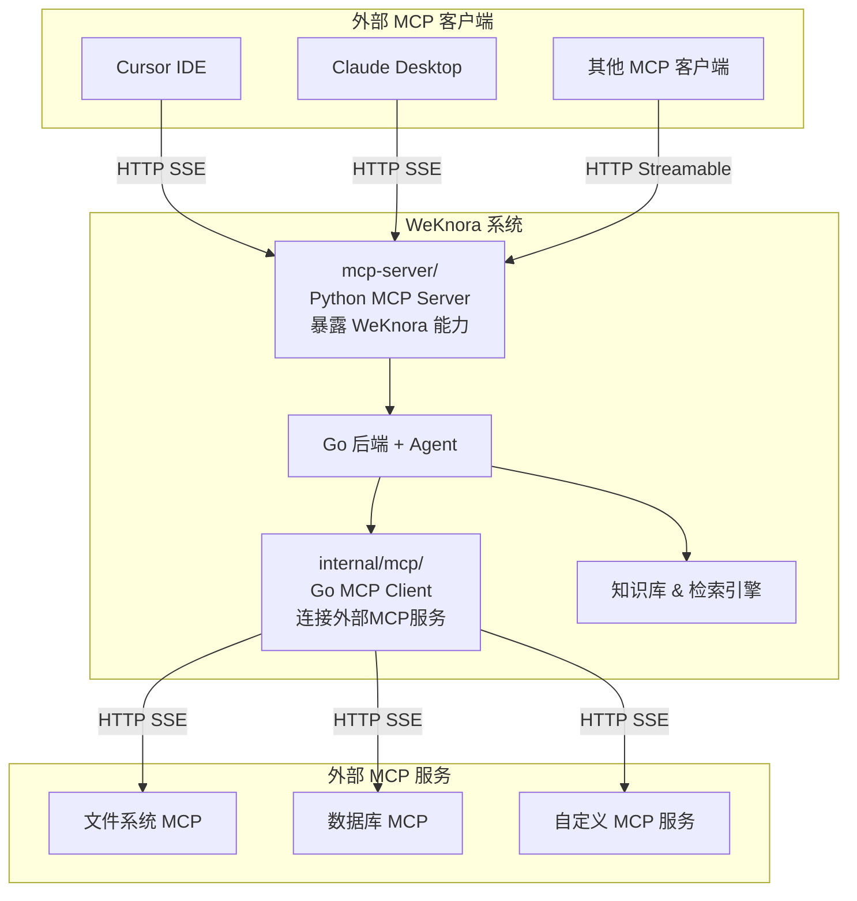

### 配置 Claude Desktop / Cursor 调用 WeKnora

```json
{
  "mcpServers": {
    "weknora": {
      "args": [
        "path/to/WeKnora/mcp-server/run_server.py"
      ],
      "command": "python",
      "env": {
        "WEKNORA_API_KEY": "sk-你的APIKey（在开发者工具请求头 x-api-key 中获取）",
        "WEKNORA_BASE_URL": "http://localhost:8080/api/v1"
      }
    }
  }
}
```

也可以 pip 安装后直接使用：

```bash
pip install weknora-mcp-server
python -m weknora-mcp-server
```

---

## 1.6 开发者快速模式

```bash
# 方法一：Make 命令（推荐）
make dev-start      # 启动 PostgreSQL + Redis 等基础设施
make dev-app        # 启动 Go 后端（Air 热重载，修改代码 5-10s 生效）
make dev-frontend   # 启动前端（Vite HMR 即时热更新）

# 方法二：一键启动
./scripts/quick-dev.sh
```

- ✅ 前端修改：Vite HMR 即时生效，无需刷新
- ✅ 后端修改：Air 热重载，5-10 秒重启
- ✅ 无需重新 build Docker 镜像
- ✅ 支持 IDE 断点调试（Go delve）

---

# Part 2：架构与核心流程

## 2.1 整体系统架构

### 图 2-1：WeKnora 整体系统架构图

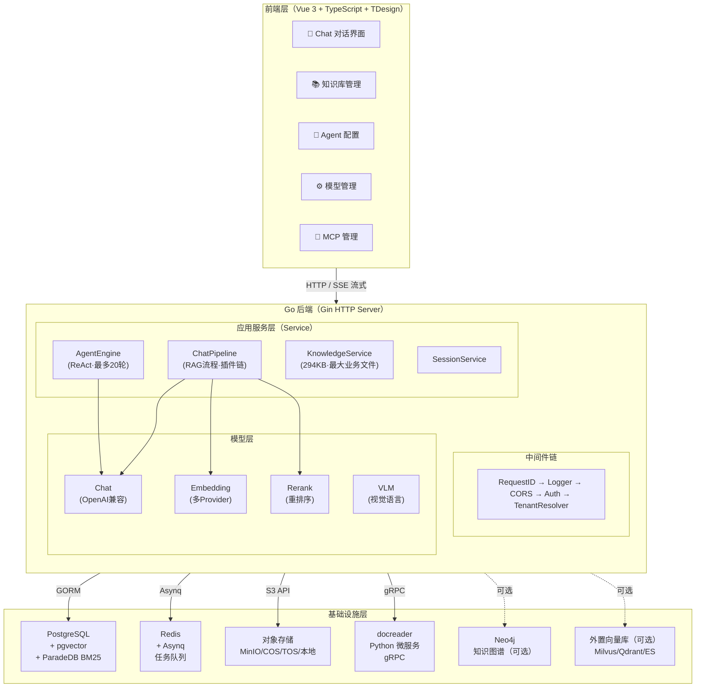

---

## 2.2 RAG Pipeline 完整流程

WeKnora 的 RAG 流程采用**事件驱动的插件化责任链架构**，每个阶段是独立插件，通过 `EventManager` 串联，支持灵活替换和扩展。

### 图 2-2：RAG Pipeline 完整数据流（插件责任链）

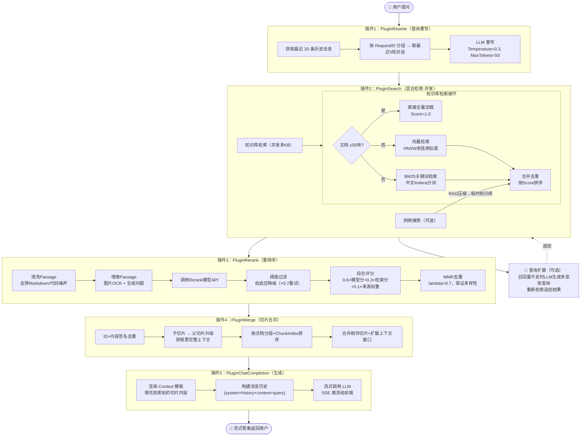

### 综合评分公式

| 权重      | 来源            | 说明                         |
| --------- | --------------- | ---------------------------- |
| **60%**   | Rerank 模型评分 | 语义相关性（最重要）         |
| **30%**   | 基础检索评分    | 向量余弦/BM25 原始分         |
| **10%**   | 来源权重        | 知识库(1.0) > 网络搜索(0.95) |
| **×乘数** | 位置先验        | 文档前段内容轻微加分 ±5%     |

---

## 2.3 ReAct Agent 执行流程

### 图 2-3：ReAct Agent 完整执行时序图

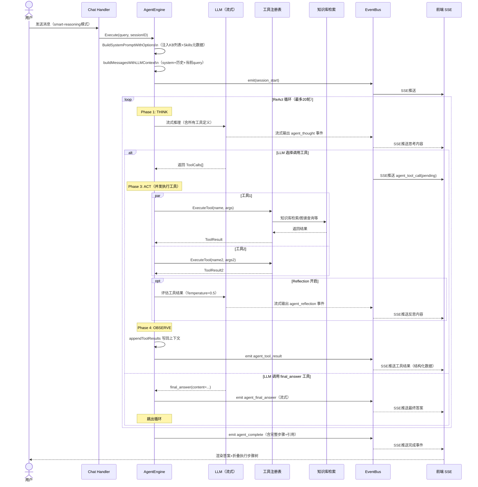

### 图 2-4：Agent 工具选择决策流程

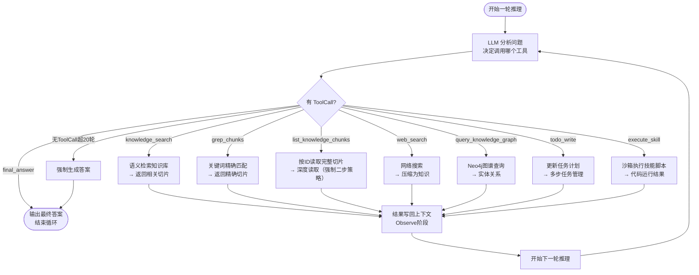

---

## 2.4 文档解析异步流程

### 图 2-5：文档上传到向量化完整异步流程

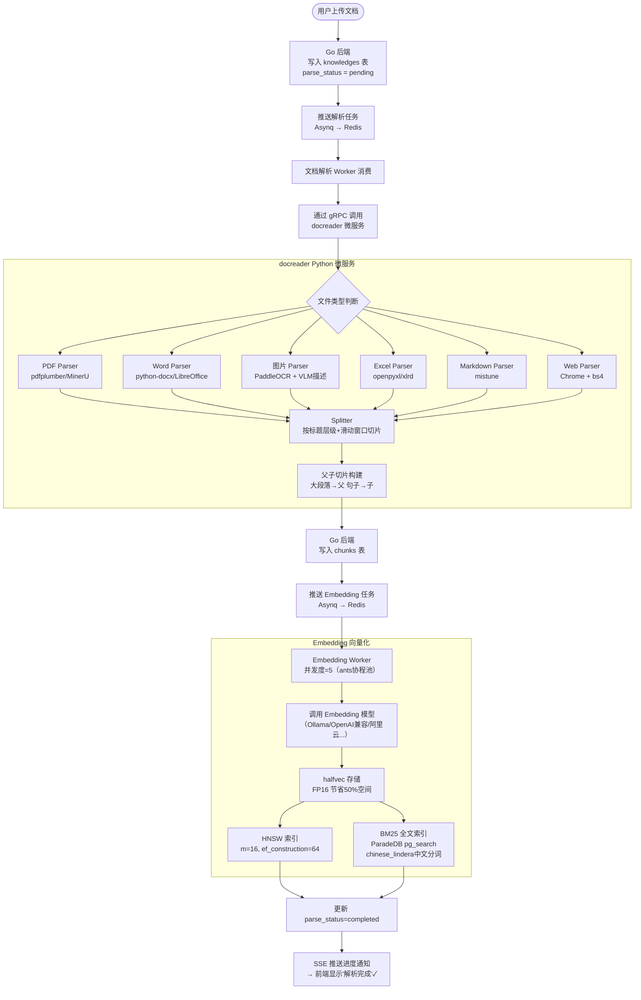

### 图 2-6：父子切片层级结构与检索升级机制

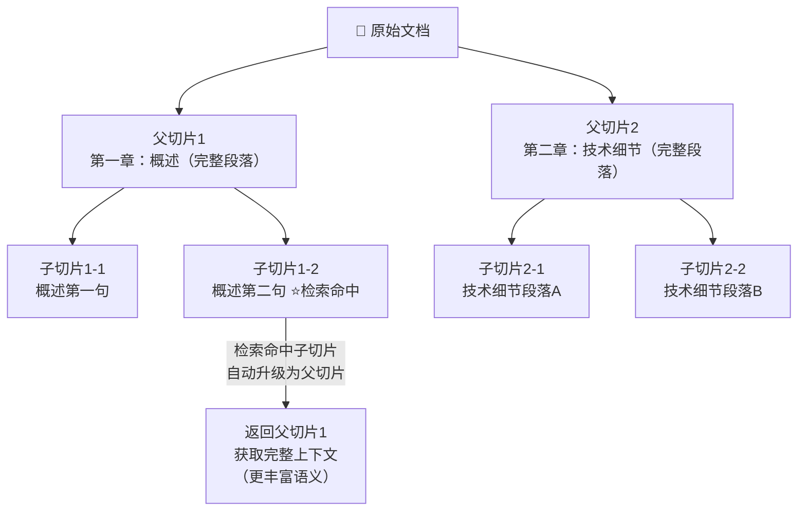

---

## 2.5 MCP 双向集成架构

### 图 2-7：MCP 双向集成完整架构

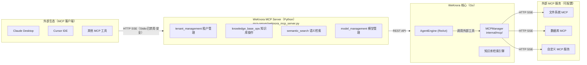

> 🔒 **安全设计**：WeKnora 已禁用 MCP Stdio 传输（防止命令注入攻击），仅允许 HTTP SSE 和 HTTP Streamable 传输。工具注册采用 first-wins 策略防止同名工具覆盖攻击。

---

## 2.6 技术栈全景

### 图 2-8：WeKnora 完整技术栈

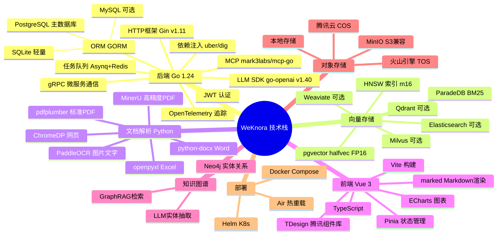

---

## 2.7 数据模型设计

### 图 2-9：核心数据库表关系图（ER 图）

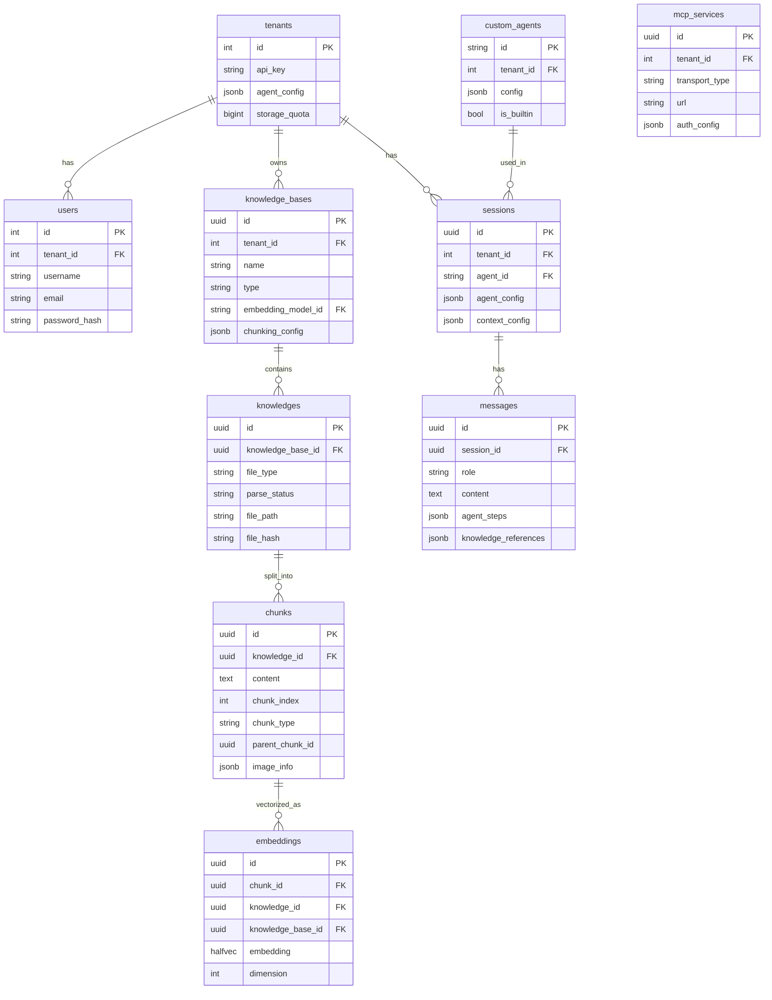

### 图 2-10：多租户隔离与认证流程

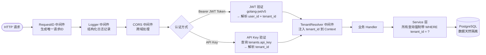

---

# 总结

WeKnora 是一个工程完成度相当高的开源项目。从架构设计来看，有几点特别值得关注：

**架构设计亮点：**
- RAG Pipeline 插件化责任链，可灵活扩展阶段
- ReAct Agent 事件驱动，全程 SSE 流式推送
- 文档解析独立微服务，gRPC 解耦，可单独扩容
- MCP 双向集成，既对外暴露能力，又能调用外部工具
- halfvec + HNSW 向量存储，节省 50% 空间
- PostgreSQL 一库搞定向量+全文检索，减少依赖

**与同类产品横向对比：**

| 维度       | WeKnora                   | RAGFlow    | Dify       |
| ---------- | ------------------------- | ---------- | ---------- |
| RAG 深度   | ⭐⭐⭐⭐⭐ 插件链+父子切片+MMR | ⭐⭐⭐⭐⭐      | ⭐⭐⭐⭐       |
| Agent 能力 | ⭐⭐⭐⭐⭐ ReAct+工具+反思     | ⭐⭐⭐        | ⭐⭐⭐⭐⭐      |
| MCP 集成   | ⭐⭐⭐⭐⭐ 双向集成            | ⭐⭐         | ⭐⭐⭐⭐       |
| 部署难度   | ⭐⭐⭐ Docker 一键           | ⭐⭐⭐        | ⭐⭐⭐        |
| 二次开发   | ⭐⭐⭐⭐⭐ Go+Vue 标准栈       | ⭐⭐⭐        | ⭐⭐⭐⭐       |
| 开源协议   | MIT（完全开源）           | Apache 2.0 | Apache 2.0 |

> 🌟 **项目地址**：https://github.com/Tencent/WeKnora
> **官网**：https://weknora.weixin.qq.com
> **协议**：MIT License
