# 腾讯开源 WeKnora：你的开源版 IMA，私有化部署的 AI 知识库

> 企业文档理解 · RAG 检索增强生成 · ReAct Agent · MCP 工具集成 · Skills 沙箱执行
>
> GitHub：https://github.com/Tencent/WeKnora | 官网：https://weknora.weixin.qq.com | MIT License | v0.3.3

---

## WeKnora 实现了 OpenClaw 定义的三大 Agent 核心能力

OpenClaw（开放爪子框架）定义现代 AI Agent 必须具备三个基本维度：**Memory（记忆）**、**Skills + Sandbox（能力扩展 + 安全执行）**、**Agent Loop（循环推理）**。WeKnora 对这三者均有完整实现：

| 核心能力           | WeKnora 实现                                                    | 特点                               |
| ------------------ | --------------------------------------------------------------- | ---------------------------------- |
| 🧠 Memory（记忆）   | ContextManager 多轮上下文 + Episode 摘要记忆 + 知识图谱实体记忆 | 短期 + 长期双层，智能压缩不丢信息  |
| 🔧 Skills + Sandbox | SKILL.md 渐进式加载 + Docker 沙箱执行 + 多层安全验证            | 可扩展能力包，安全隔离执行，零风险 |
| 🔄 Agent Loop       | ReAct 循环 + EventBus 事件驱动 + 最多 20 轮迭代 + 工具并发调用  | 全链路实时可观测，前端步骤树展示   |

---

## 目录

- [Part 1：部署与使用](#part-1部署与使用)
  - [1.1 WeKnora 是什么？](#11-weknora-是什么)
  - [1.2 快速部署](#12-快速部署)
  - [1.3 支持的文档类型](#13-支持的文档类型)
  - [1.4 Agent 模式介绍](#14-agent-模式介绍)
  - [1.5 接入 MCP](#15-接入-mcp)
  - [1.6 上手操作案例演示](#16-上手操作案例演示)
- [Part 2：架构与核心流程](#part-2架构与核心流程)
  - [2.1 整体系统架构](#21-整体系统架构)
  - [2.2 RAG Pipeline 流程](#22-rag-pipeline-流程)
  - [2.3 ReAct Agent 执行流程](#23-react-agent-执行流程)
  - [2.4 文档解析与向量化流程](#24-文档解析与向量化流程)
  - [2.5 记忆系统（Memory）](#25-记忆系统memory)
  - [2.6 Skills + Sandbox 扩展能力](#26-skills--sandbox-扩展能力)
  - [2.7 Agent Loop 完整执行流程](#27-agent-loop-完整执行流程)
- [结语：WeKnora 与 OpenClaw 的能力对齐](#结语weknora-与-openclaw-的能力对齐)

---

# Part 1：部署与使用

## 1.1 WeKnora 是什么？

> 如果你用过腾讯的 IMA，WeKnora 可以理解成它的开源、可私有化部署版本。数据完全在自己手里，模型可以选本地也可以接云端，整个系统跑在你自己的服务器上。

WeKnora 是腾讯开源的企业级 AI 知识库框架，核心是 **RAG（检索增强生成）**——上传你的文档，用自然语言提问，系统从文档里精准检索后交给大模型生成答案。Agent 模式下还能多步推理、调用工具，完成更复杂的分析任务。

| 场景            | 用法                                                           |
| --------------- | -------------------------------------------------------------- |
| 企业内部知识库  | 上传手册、规范文档，员工自然语言查询，系统给出有引用来源的答案 |
| 合同 / 法规分析 | 上传 PDF，提问关键条款，精确定位到原文段落                     |
| 数据分析报告    | 上传 Excel / CSV，Agent 自动分析并生成结论报告                 |
| 学术研究辅助    | 上传论文集，跨文档检索关联结论                                 |
| 产品技术支持    | 搭建产品文档知识库，替代初级客服问答                           |

---

## 1.2 快速部署

只需 Docker + Git，三步启动：

```bash
# 1. 克隆仓库
git clone https://github.com/Tencent/WeKnora.git
cd WeKnora

# 2. 复制并编辑环境变量
cp .env.example .env
# 在 .env 中填写 LLM API Key 或指向本地 Ollama 地址

# 3. 启动服务
docker compose up -d                         # 最小核心服务
# 或
docker-compose --profile full up -d          # 全功能（含 Neo4j 知识图谱等）
```

启动后访问 `http://localhost`，注册账号，进入初始化向导配置模型即可。

| 服务          | 说明                                   | 端口        |
| ------------- | -------------------------------------- | ----------- |
| Web UI + 后端 | Go 后端 + Vue 前端（Nginx 托管）       | :80 / :8080 |
| PostgreSQL    | 主数据库（含向量扩展 + BM25 全文检索） | :5432       |
| Redis         | 异步任务队列 + 缓存                    | :6379       |
| docreader     | Python 文档解析微服务（gRPC）          | :50051      |
| Neo4j（可选） | 知识图谱存储                           | :7474       |
| MinIO（可选） | 对象存储                               | :9000       |

> 💡 **开发者模式**：`make dev-start` 启动基础设施，`make dev-app` 启动后端（Air 热重载 5s 生效），`make dev-frontend` 启动前端（Vite HMR 即时生效）。

---

## 1.3 支持的文档类型

| 格式                 | 解析引擎                          | 特殊能力                 |
| -------------------- | --------------------------------- | ------------------------ |
| PDF                  | pdfplumber / MinerU（高精度模式） | 表格、公式、多栏版面还原 |
| Word（.docx / .doc） | python-docx / LibreOffice         | 图片 OCR 文字提取        |
| 图片（.png / .jpg）  | PaddleOCR + VLM 视觉描述          | 文字识别 + 图片语义理解  |
| Excel / CSV          | openpyxl / DuckDB                 | 数据分析 Agent 模式      |
| Markdown             | mistune                           | 保留标题层级结构         |
| 网页 URL             | ChromeDP + html2markdown          | 动态页面渲染抓取         |

---

## 1.4 Agent 模式介绍

WeKnora 提供两种对话模式，在输入框左下角切换：

| 模式                    | 说明                           | 适合场景                 |
| ----------------------- | ------------------------------ | ------------------------ |
| ⚡ **快速回答**          | 单次 RAG 检索，快速响应        | 明确知识点查询、FAQ 查询 |
| 🧠 **深度推理（Agent）** | ReAct 多轮工具调用，最多 20 轮 | 跨文档分析、数据报告生成 |

Agent 可调用的内置工具包括：知识库语义检索、关键词精确匹配、文档全文读取、知识图谱查询、网络搜索、网页抓取、任务计划管理等，整个推理过程在前端实时可见（思考步骤 + 工具调用 + 最终答案流式展示）。

---

## 1.5 接入 MCP

WeKnora 内置 MCP Server（Python），可让 Cursor、Claude Desktop 等工具直接调用 WeKnora 的知识库检索能力：

```json
{
  "mcpServers": {
    "weknora": {
      "command": "python",
      "args": ["path/to/WeKnora/mcp-server/run_server.py"],
      "env": {
        "WEKNORA_API_KEY": "sk-你的APIKey",
        "WEKNORA_BASE_URL": "http://localhost:8080/api/v1"
      }
    }
  }
}
```

反过来，WeKnora 的 Agent 也可以主动连接外部 MCP 服务（文件系统、数据库、自定义工具），在 Agent 管理页面配置即可。安全起见，Stdio 传输已禁用，只支持 HTTP SSE 和 HTTP Streamable。

---

## 1.6 上手操作案例演示

下面以完整使用链路为例，展示从零开始到用 Agent 完成知识库问答的全过程。

### Step 1：配置模型

首次进入系统会自动跳转初始化向导。依次配置 LLM 大语言模型（支持 Ollama 本地模型或 DeepSeek / Qwen 等远程 API）、Embedding 嵌入模型、Rerank 重排序模型。

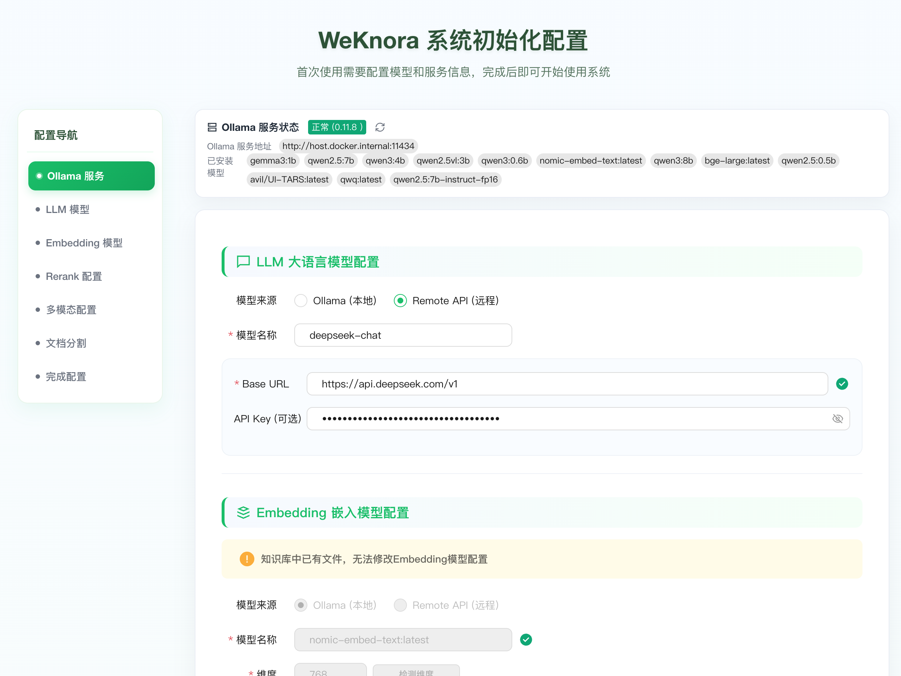

*图 1：系统初始化 — 配置 LLM 模型（此处以 DeepSeek 远程 API + Ollama 本地 Embedding 为例）*

### Step 2：创建知识库

在知识库页面点击「新建知识库」，选择类型（文档型或 FAQ 型），填写名称与描述。文档型适合上传 PDF、Word 等文件；FAQ 型适合维护结构化问答对。

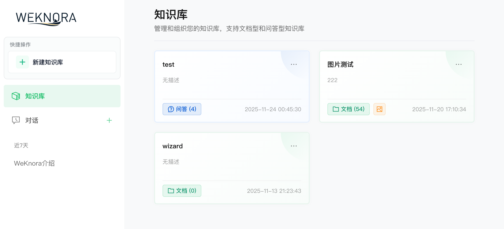

*图 2：知识库管理页面 — 可创建多个不同类型的知识库，支持文档型和问答型*

### Step 3：上传文档

进入知识库详情页，拖拽或点击上传文档。系统异步解析（PDF / DOCX / 图片等），切片后向量化入库。支持批量上传、URL 导入、文件夹导入。解析完成后状态变为「已完成」即可检索。

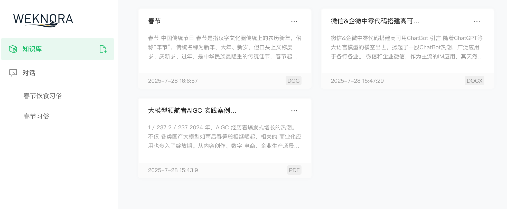

*图 3：文档上传页面 — 支持 DOC、DOCX、PDF 等多种格式，系统自动解析并建立向量索引*

### Step 4：切换 Agent 模式提问

新建对话，在输入框左下角点击「Agent 模式」，选择绑定知识库，发送问题。Agent 自动进行多步推理：关键词检索 → 语义检索 → 深度读取 → 生成有引用来源的答案。整个推理链路实时展示。

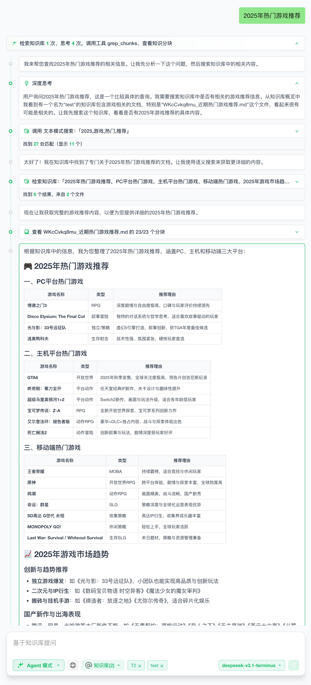

*图 4：Agent 模式推理过程 — 可看到完整的思考步骤、工具调用过程和检索到的知识片段*

### Step 5：查看答案与引用来源

Agent 输出带结构的 Markdown 答案，每个关键结论都标注了来源（来自哪个文档的哪个段落）。在「快速回答」模式下，答案更简洁但同样附有知识库引用标记，可点击跳转查看原文。

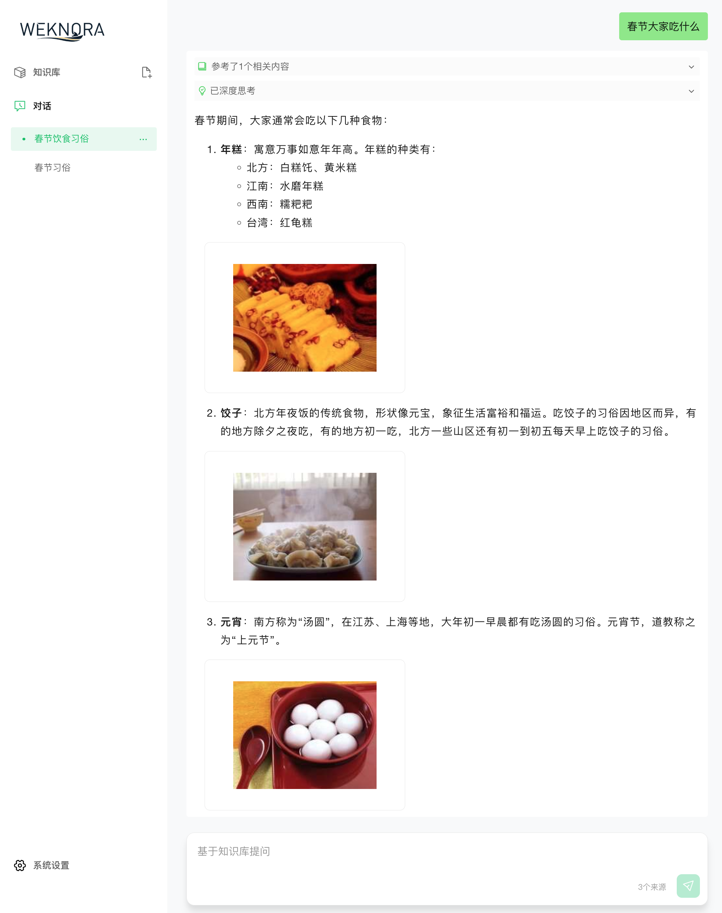

*图 5：回答展示 — 基于知识库内容生成结构化答案，自动标注引用来源，支持图片内容展示*

---

# Part 2：架构与核心流程

WeKnora 采用**多语言微服务架构**：Go 后端负责业务逻辑和 API，Python 微服务负责文档解析，Vue 3 前端负责交互展示，三者通过 HTTP/SSE 和 gRPC 协作。

## 2.1 整体系统架构

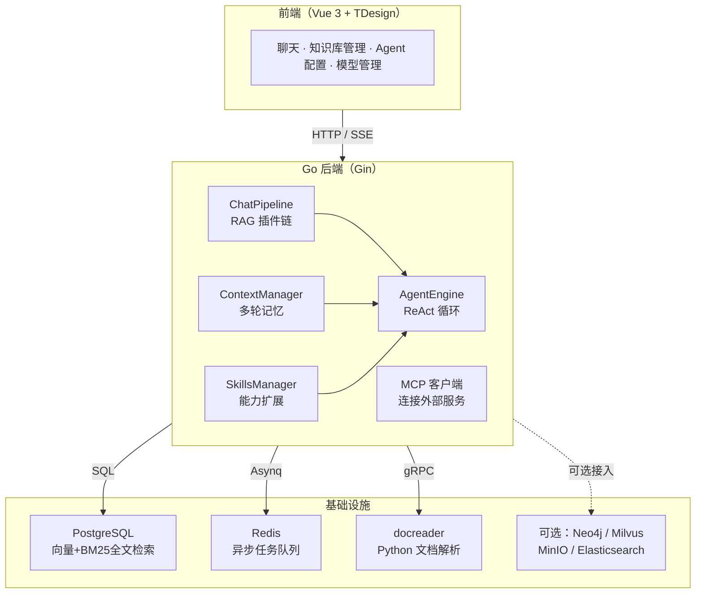

---

## 2.2 RAG Pipeline 流程

WeKnora 的 RAG 流程是一条**事件驱动的插件责任链**，5 个插件依次处理，每个插件职责清晰、可替换：

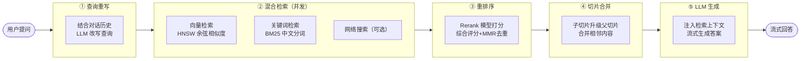

### 关键设计点

| 设计             | 说明                                                        |
| ---------------- | ----------------------------------------------------------- |
| 小文档直接加载   | 切片数 ≤ 50 块的文档直接全量加载，跳过向量检索，精度更高    |
| halfvec 向量存储 | 使用 FP16 半精度浮点存储向量，比 FP32 节省 50% 存储空间     |
| 父子切片架构     | 检索命中子切片时自动升级为父切片，获取更完整的上下文内容    |
| 综合评分公式     | 0.6 × Rerank 模型分 + 0.3 × 检索原始分 + 0.1 × 来源权重     |
| MMR 去重         | 最大边际相关性算法（λ=0.7），在相关性和多样性之间取平衡     |
| 自适应降级       | Rerank 阈值过高无结果时，自动 ×0.7 降级重试，保证有答案返回 |

---

## 2.3 ReAct Agent 执行流程

Agent 采用 **ReAct（Reason + Act）** 范式，LLM 自主决策每一步调用哪个工具，直到得出最终答案。整个过程通过 SSE 实时推流给前端展示。

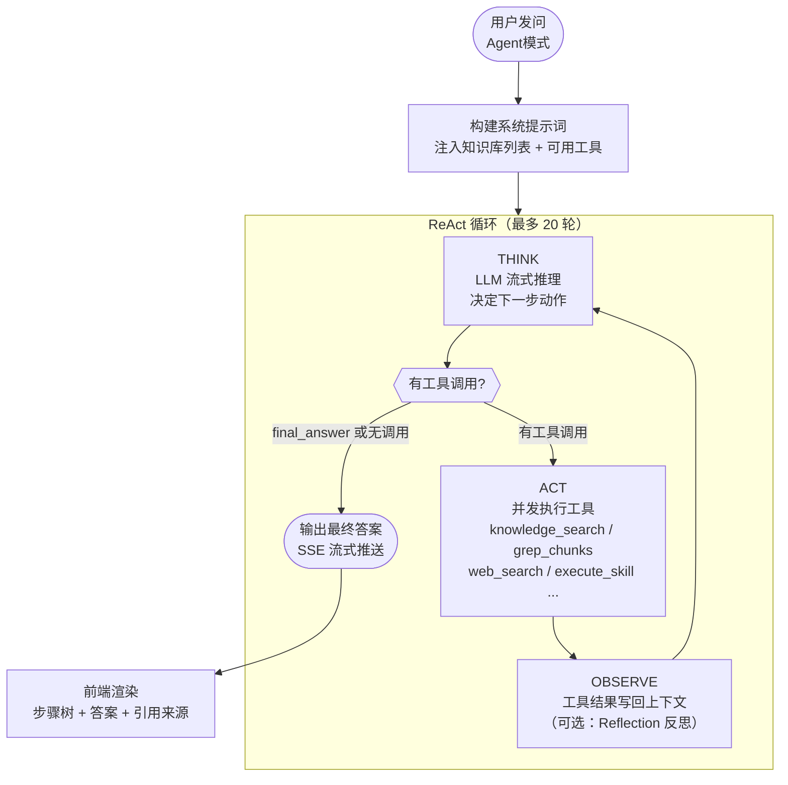

Agent 的系统提示词强制执行「**侦察-计划-执行**」工作流：先用关键词检索定位，再用语义检索扩展，再深度读取文档，最后才生成答案。禁止 LLM 凭内部知识直接回答，确保所有结论都来自知识库。

---

## 2.4 文档解析与向量化流程

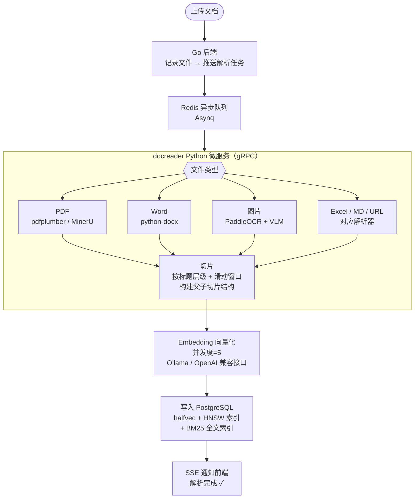

### 父子切片设计

文档切片分两层：大段落作为父切片，句子或小段作为子切片。向量检索命中子切片时，系统自动返回对应父切片的完整内容——既保证检索精度，又保证上下文完整性，不会因切片太碎丢失语义。

> 📌 **向量存储优化**：PostgreSQL + pgvector 使用 `halfvec`（FP16）存储向量，配合 HNSW 索引（m=16）；同时集成 ParadeDB 的 BM25 全文检索扩展，支持中文 lindera 分词。一个 PostgreSQL 实例同时提供向量检索和全文检索，减少外部依赖。如有更高性能需求，可切换为 Milvus / Qdrant / Elasticsearch。

---

## 2.5 记忆系统（Memory）

WeKnora 的 Memory 实现对应 OpenClaw 中的记忆层，分为**短期记忆（上下文窗口）**和**长期记忆（Episode + 知识图谱）**两个层次：

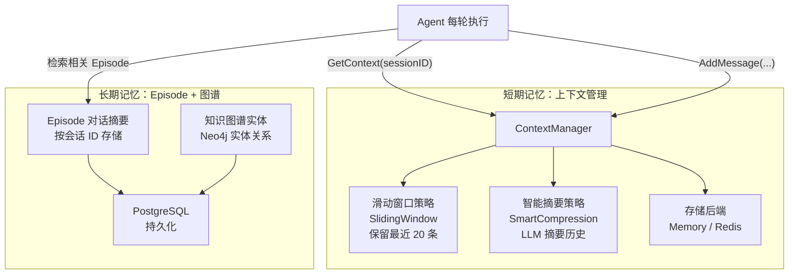

| 记忆层           | 机制                                                      | 作用                        |
| ---------------- | --------------------------------------------------------- | --------------------------- |
| 上下文滑动窗口   | 保留最近 N 条消息，超出丢弃最老的                         | 轻量多轮对话，低 Token 消耗 |
| LLM 智能摘要     | 超过阈值时，LLM 自动摘要旧消息合并为 Summary              | 长对话不丢失关键信息        |
| Episode 摘要记忆 | 每轮对话结束后生成摘要存入 DB，下次检索相关片段注入上下文 | 跨会话记忆用户信息和偏好    |
| 知识图谱实体     | 从对话中抽取实体关系存入 Neo4j                            | 结构化记忆复杂关联知识      |

---

## 2.6 Skills + Sandbox 扩展能力

Skills 是 WeKnora 的能力扩展机制，对应 OpenClaw 中的 Skills 层。每个 Skill 是一个目录，包含 `SKILL.md` 定义文件和可执行脚本，Agent 可以按需加载并在沙箱中安全执行。

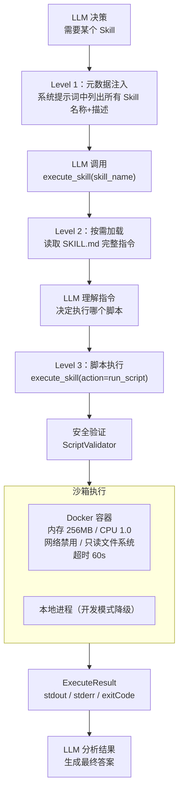

| 安全层          | 保护内容                                               |
| --------------- | ------------------------------------------------------ |
| 脚本内容验证    | 检测 rm -rf、Fork Bomb、反弹 Shell、代码注入等危险模式 |
| 参数注入检查    | 检测 Shell 操作符、命令替换、路径遍历                  |
| Docker 容器隔离 | 内存/CPU 限制、网络禁用、只读根文件系统                |
| 命令白名单      | 仅允许 python/node/bash/cat/grep 等安全命令            |
| 路径安全验证    | 禁止访问 Skill 目录外的文件（防路径遍历）              |

---

## 2.7 Agent Loop 完整执行流程

这是将 Memory、Skills、RAG、MCP 整合在一起的完整 Agent 循环——也是 WeKnora 实现 OpenClaw Agent Loop 的核心设计：

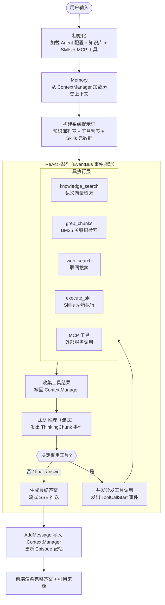

---

# 结语：WeKnora 与 OpenClaw 的能力对齐

WeKnora 不只是一个 RAG 工具，它是一个完整的 AI Agent 知识库平台。回顾 OpenClaw 对现代 AI Agent 的三个核心能力要求，WeKnora 的实现情况如下：

| OpenClaw 能力      | WeKnora 实现                                                    | 特点                               |
| ------------------ | --------------------------------------------------------------- | ---------------------------------- |
| 🧠 Memory（记忆）   | ContextManager 多轮上下文 + Episode 摘要记忆 + 知识图谱实体记忆 | 短期 + 长期双层，智能压缩不丢信息  |
| 🔧 Skills + Sandbox | SKILL.md 渐进式加载 + Docker 沙箱执行 + 多层安全验证            | 可扩展能力包，安全隔离执行，零风险 |
| 🔄 Agent Loop       | ReAct 循环 + EventBus 事件驱动 + 最多 20 轮迭代 + 工具并发调用  | 全链路实时可观测，前端步骤树展示   |

与 IMA 相比，WeKnora 的优势在于**完全开源、数据自主、高度可定制**。IMA 是更成熟的产品，用户体验更完善；WeKnora 则是给技术团队的底层框架，你可以修改任何一个模块，接入任何模型，部署在任何环境。

**适合 WeKnora 的场景**：企业私有化部署、数据合规要求严格、需要深度定制 RAG 流程、希望集成内部工具（通过 MCP / Skills）、希望基于此二次开发自己的 AI 产品。

**推荐使用链路**：Docker 一键部署 → 配置本地 Ollama 模型（无 API 成本）→ 上传企业文档 → 用内置数据分析师 Agent 跑第一个分析任务 → 按需扩展 Skills 和 MCP 工具。

---

> 🌟 **项目地址**：https://github.com/Tencent/WeKnora | **官网**：https://weknora.weixin.qq.com | **协议**：MIT License
